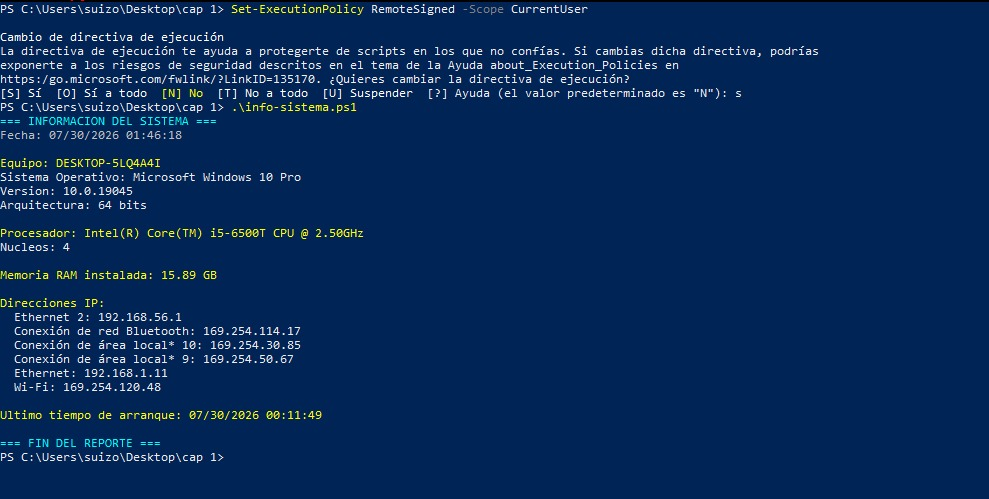
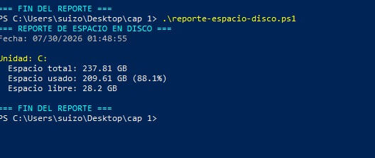
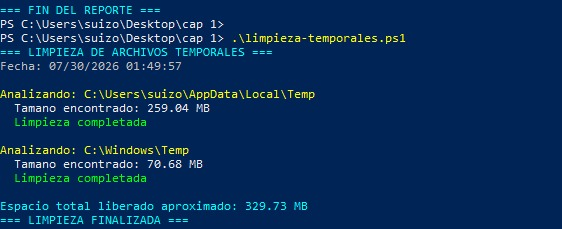
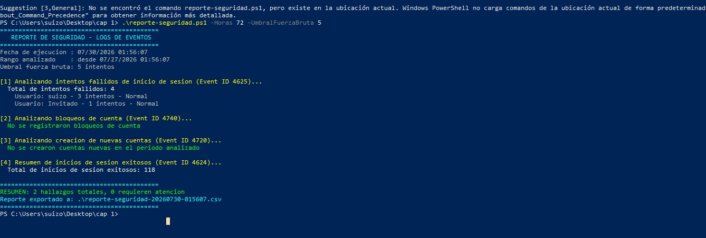

# Proyecto 05: Automatización con PowerShell

Conjunto de scripts en PowerShell diseñados para automatizar tareas comunes de soporte técnico y generar reportes de seguridad básicos, reduciendo el tiempo invertido en tareas manuales repetitivas.

## 🎯 Objetivo

Demostrar capacidad de automatización aplicada a escenarios reales de soporte IT y monitoreo de seguridad: diagnóstico rápido del sistema, mantenimiento preventivo, y detección de actividad sospechosa en los logs de eventos de Windows.

## 📁 Scripts incluidos

| Script | Función |
|---|---|
| `info-sistema.ps1` | Genera un resumen del equipo (SO, procesador, RAM, IPs) |
| `reporte-espacio-disco.ps1` | Reporta espacio usado/libre en todas las unidades, con alerta si supera el 90% |
| `limpieza-temporales.ps1` | Elimina archivos temporales del usuario y del sistema, reportando espacio liberado |
| `reporte-seguridad.ps1` | Analiza el log de Seguridad de Windows en busca de actividad sospechosa (fuerza bruta, bloqueos de cuenta, cuentas nuevas) |

## 🖥️ 1. Información del sistema

Genera un resumen rápido del equipo: sistema operativo, procesador, memoria RAM instalada y direcciones IP activas — útil para documentar el estado de un equipo antes de una intervención técnica.

```powershell
.\info-sistema.ps1
```



## 💽 2. Reporte de espacio en disco

Recorre todas las unidades del equipo y calcula el espacio total, usado y libre, mostrando una advertencia si alguna unidad supera el 90% de uso.

```powershell
.\reporte-espacio-disco.ps1
```



## 🧹 3. Limpieza de archivos temporales

Elimina el contenido de las carpetas temporales del usuario (`%TEMP%`) y del sistema (`C:\Windows\Temp`), reportando el espacio total liberado.

```powershell
.\limpieza-temporales.ps1
```



## 🛡️ 4. Reporte de seguridad (logs de eventos)

Script más avanzado que analiza el log de Seguridad de Windows en busca de patrones sospechosos:

- **Event ID 4625** — Intentos fallidos de inicio de sesión, agrupados por usuario para detectar posibles ataques de fuerza bruta
- **Event ID 4740** — Bloqueos de cuenta
- **Event ID 4720** — Creación de nuevas cuentas de usuario
- **Event ID 4624** — Resumen de inicios de sesión exitosos

Incluye parámetros configurables (rango de horas a analizar, umbral de intentos para considerar fuerza bruta) y exporta automáticamente los hallazgos a un archivo CSV con marca de tiempo.

```powershell
.\reporte-seguridad.ps1 -Horas 24 -UmbralFuerzaBruta 3
```



## ⚙️ Requisitos de ejecución

- PowerShell ejecutado como Administrador (necesario para leer el log de Seguridad)
- Política de ejecución habilitada:
```powershell
Set-ExecutionPolicy RemoteSigned -Scope CurrentUser
```

## 📌 Conclusiones

Estos scripts representan automatizaciones prácticas que reducen tiempo en tareas de soporte técnico cotidianas, además de introducir un caso de uso más avanzado orientado a seguridad: el análisis programático de logs de eventos para identificar patrones de riesgo, una habilidad directamente aplicable a un rol de SOC Analyst.
