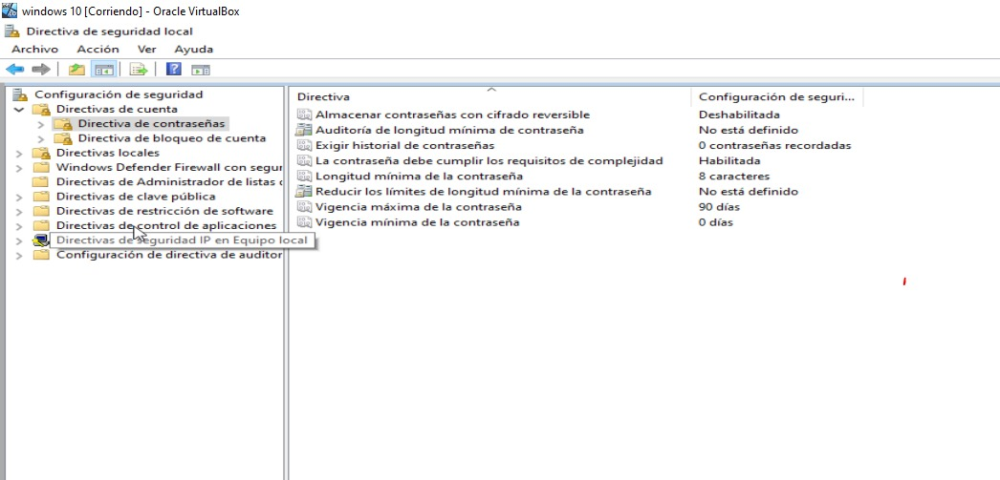
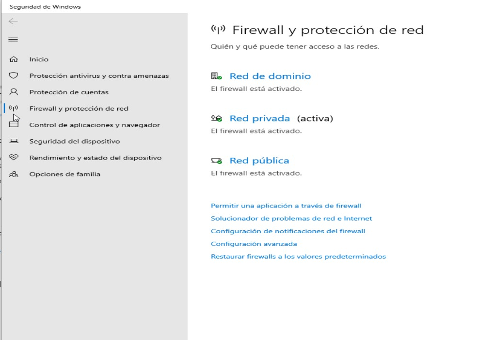
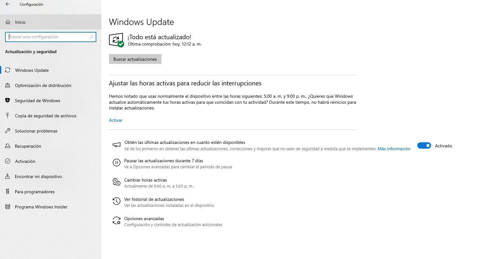
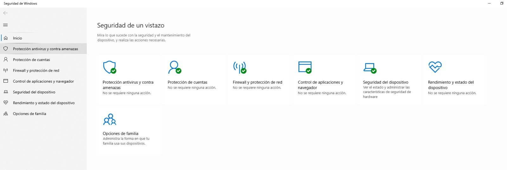
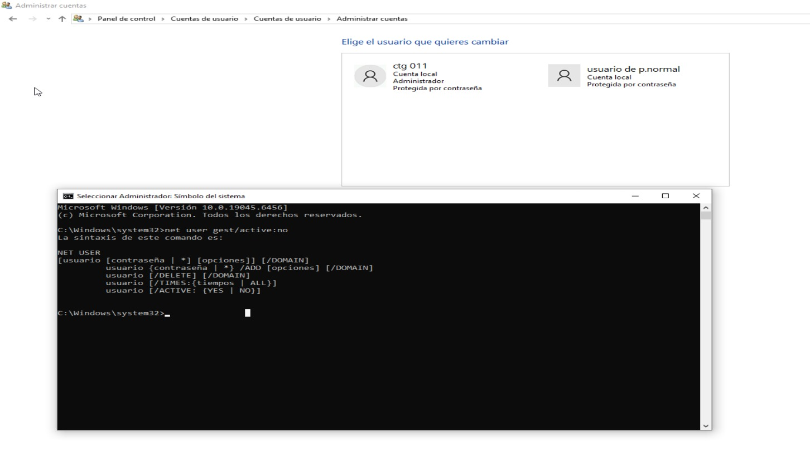
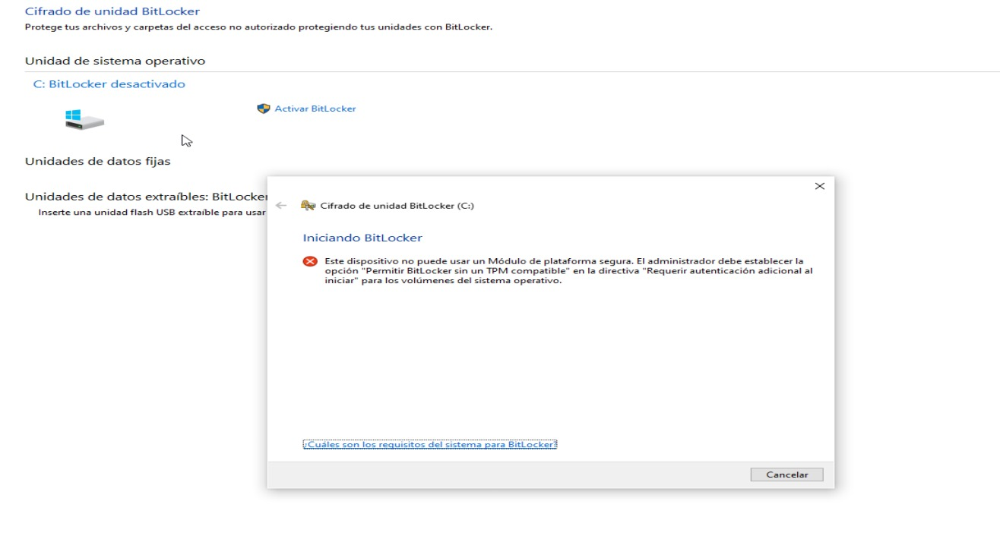
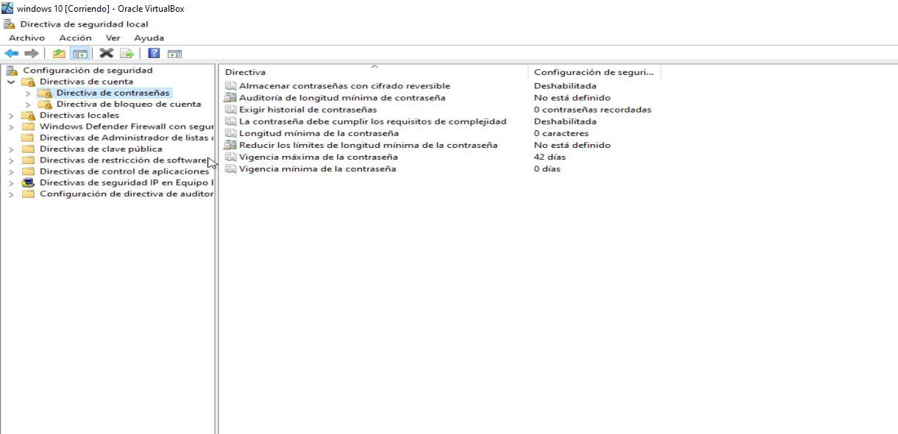

# Proyecto 04: Hardening de Endpoint

Aplicación de un checklist de seguridad básica sobre un endpoint Windows (entorno virtualizado), documentando el estado inicial y las medidas aplicadas para reducir la superficie de ataque del equipo.

## 🎯 Objetivo

Reforzar la seguridad de un equipo Windows aplicando controles fundamentales de hardening: políticas de contraseña, firewall, actualizaciones, antivirus, gestión de cuentas, cifrado de disco y auditoría de eventos — replicando el proceso que se aplicaría sobre un endpoint corporativo real.

## ✅ Checklist de hardening aplicado

| # | Control | Estado |
|---|---|---|
| 1 | Política de contraseñas | Aplicado |
| 2 | Firewall de Windows | Verificado / Activo |
| 3 | Windows Update | Verificado / Actualizado |
| 4 | Windows Defender (Antivirus) | Verificado / Activo |
| 5 | Cuenta de Invitado | Deshabilitada |
| 6 | Cifrado de disco (BitLocker) | No disponible (limitación de entorno virtualizado) |
| 7 | Auditoría de eventos de inicio de sesión | Habilitada |

## 🔐 1. Política de contraseñas

Se configuró la Directiva de seguridad local (`secpol.msc`) para exigir contraseñas más robustas.



- Longitud mínima de contraseña: 8 caracteres
- Vigencia máxima: 90 días
- Requisitos de complejidad habilitados

## 🛡️ 2. Firewall de Windows

Se verificó que el Firewall de Windows Defender estuviera activo en los tres perfiles de red (dominio, privada, pública).



## 🔄 3. Windows Update

Se revisó el estado de actualizaciones del sistema y se instalaron las pendientes.



## 🦠 4. Windows Defender (Antivirus)

Se confirmó que la protección en tiempo real de Windows Defender estuviera activa.



## 👤 5. Gestión de cuentas de usuario

Se identificó que la cuenta "Invitado" estaba disponible y se procedió a deshabilitarla, ya que representa una superficie de ataque innecesaria.

```
net user Guest /active:no
```



## 💽 6. Cifrado de disco (BitLocker)

Se intentó activar BitLocker sobre la unidad del sistema operativo (C:).



**Hallazgo:** BitLocker no pudo activarse en el entorno de VirtualBox debido a la ausencia de un módulo TPM (Trusted Platform Module) compatible, una limitación común en máquinas virtuales que no emulan hardware TPM 2.0 de forma nativa. En un endpoint físico real con TPM disponible, este control se completaría sin inconvenientes siguiendo el mismo procedimiento.

## 📋 7. Auditoría de eventos

Se habilitó la auditoría de eventos de inicio de sesión (éxito y error) desde la Directiva de seguridad local, permitiendo el registro de intentos de acceso al equipo para fines de monitoreo.



## 📌 Conclusiones

Este ejercicio permitió aplicar de forma práctica los controles de seguridad más comunes en un proceso de hardening de endpoint, además de identificar y documentar una limitación técnica real (TPM no disponible en entornos virtualizados) — un tipo de hallazgo que también se presenta al asegurar equipos en entornos corporativos con hardware variado.
