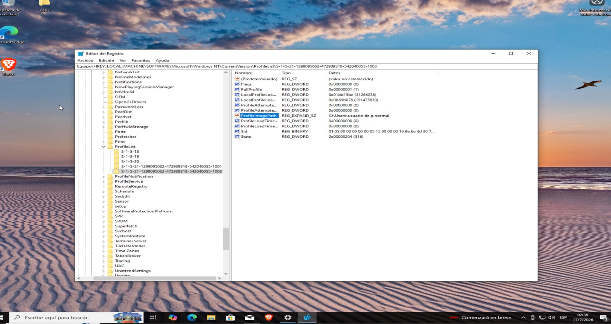
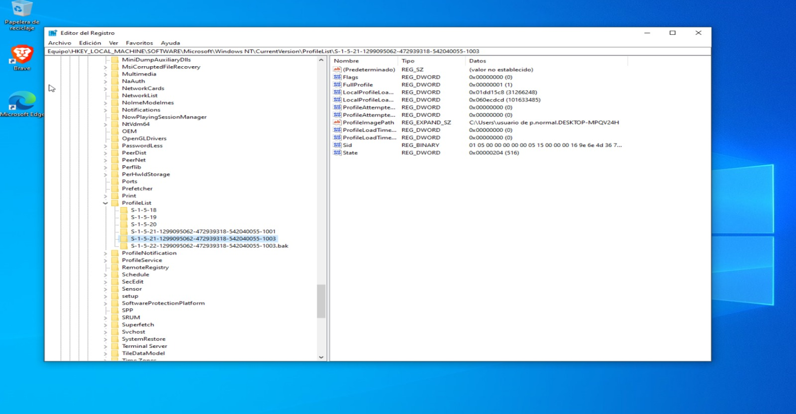

# Caso 02: Perfil de usuario corrupto

## 🎫 Síntoma reportado
Se simula un escenario de perfil de usuario corrupto renombrando la clave del registro asociada al SID del usuario, con el fin de practicar el proceso de diagnóstico y recuperación ante un perfil que Windows no logra cargar correctamente.

## 🔍 Diagnóstico

**1. Identificación del perfil en el registro**

Se navegó hasta `HKEY_LOCAL_MACHINE\SOFTWARE\Microsoft\Windows NT\CurrentVersion\ProfileList` y se identificó la clave correspondiente al usuario de prueba mediante su valor `ProfileImagePath`.

**2. Simulación del conflicto**

Se renombró la clave del SID agregando el sufijo `.bak`. Al iniciar sesión con el usuario afectado, Windows no encontró la clave original y generó automáticamente una nueva clave vacía con el mismo SID, evidenciando la creación de un perfil temporal.

## 🎯 Causa raíz
Clave del registro renombrada/inaccesible para el sistema, provocando que Windows no reconociera el perfil original y generara uno nuevo, temporal y vacío, en su lugar.

## ✅ Solución aplicada
1. Se eliminó la clave nueva y vacía creada automáticamente por Windows
2. Se renombró la clave original (`.bak`) de vuelta a su nombre correcto (el SID sin el sufijo)
3. Se cerró sesión de Administrador correctamente (Cerrar sesión, no Cambiar de usuario)
4. Se inició sesión nuevamente con el usuario de prueba, confirmando que el perfil cargó con su configuración original

## 📌 Prevención / Notas
- **Siempre exportar un respaldo** de la clave del registro antes de modificarla (click derecho → Exportar)
- Cerrar sesión correctamente en lugar de usar "Cambiar de usuario" evita conflictos de sesiones activas simultáneas, que pueden interferir con cambios recientes en el sistema
- Ante un perfil corrupto real (no simulado), este mismo proceso —identificar la clave correcta, verificar si Windows generó una nueva vacía, y restaurar la clave original— es el método estándar de recuperación