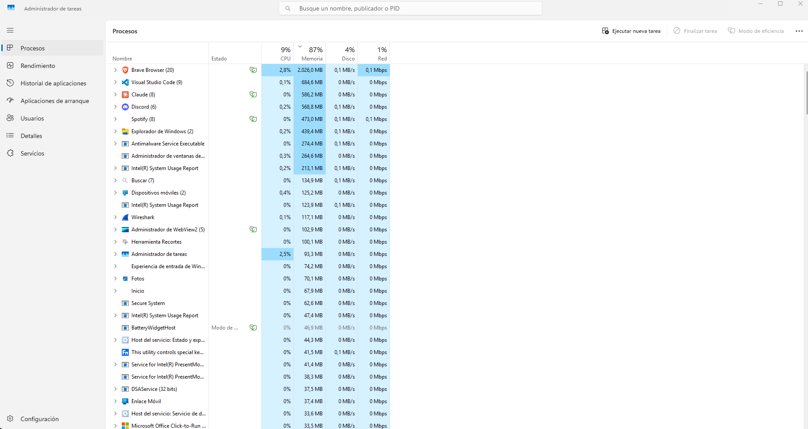
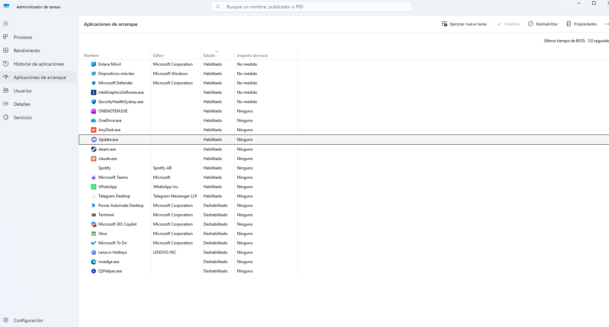
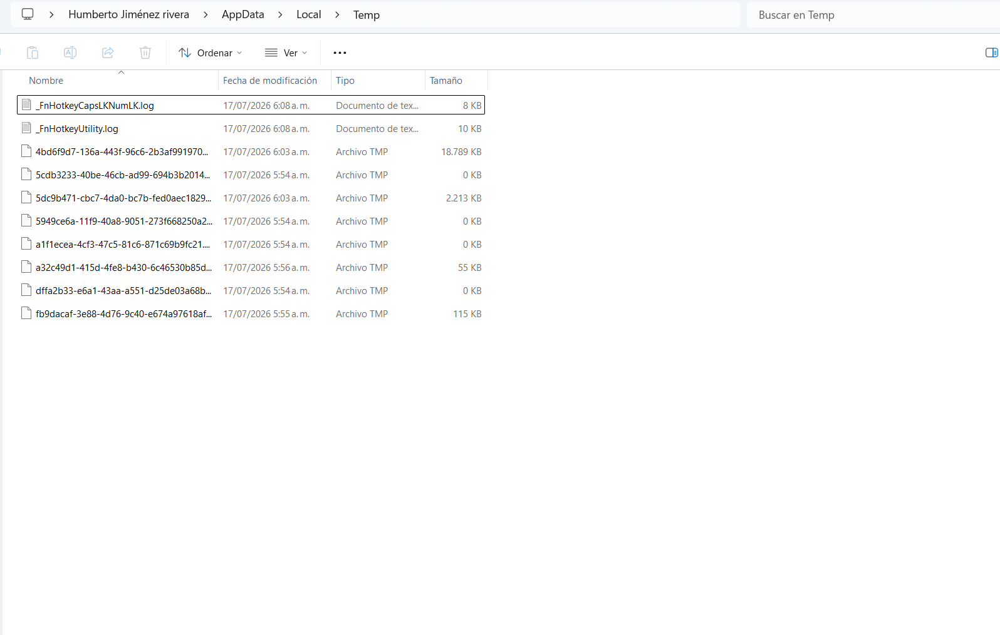
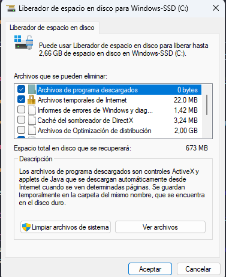
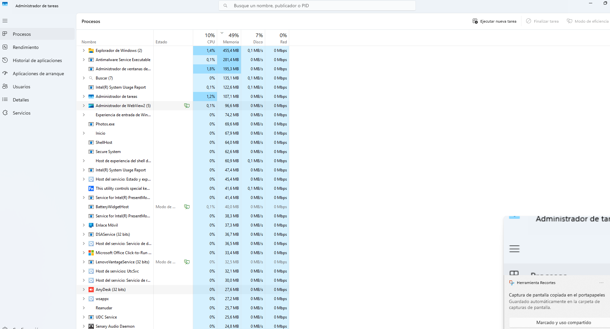

titud readme · MD
# Caso 03: Lentitud general del sistema
 
## 🎫 Síntoma reportado
El equipo presenta lentitud general: los programas tardan en abrir, el sistema responde con retraso a las acciones del usuario, y el rendimiento se siente por debajo de lo normal desde el inicio de sesión.
 
## 🔍 Diagnóstico
 
**1. Revisión de recursos en tiempo real**
 
Se abrió el Administrador de Tareas (`Ctrl + Shift + Esc`) → pestaña **Rendimiento**, generando carga real mediante múltiples pestañas de navegador abiertas simultáneamente para observar el comportamiento de CPU, Memoria y Disco.
 

 
**2. Identificación de procesos con mayor consumo**
 
En la pestaña **Procesos**, se ordenó la lista por consumo de CPU/Memoria para identificar los procesos con mayor impacto en el sistema.
 

 
**3. Revisión de programas de inicio**
 
Se revisó la pestaña **Inicio** del Administrador de Tareas, identificando programas configurados para arrancar automáticamente con Windows y su nivel de impacto.
 

 
## 🎯 Causa raíz
Exceso de programas configurados para iniciar automáticamente con Windows, sumado a múltiples procesos de navegador consumiendo memoria simultáneamente y acumulación de archivos temporales, generando cuellos de botella en el rendimiento general del sistema.
 
## ✅ Solución aplicada
 
**1. Deshabilitar programas de inicio innecesarios**
- Se identificaron programas con impacto "Alto" que no son esenciales para el arranque
- Click derecho sobre cada uno → **Deshabilitar**
**2. Eliminar archivos temporales**
- `Win + R` → se escribió `%temp%` → Enter
- Se seleccionaron todos los archivos (`Ctrl + A`) y se eliminaron de forma permanente (Shift + Delete)
- Los archivos en uso que no pudieron eliminarse se omitieron sin afectar el proceso

 
**3. Verificación de espacio liberado con Liberador de espacio en disco**
- `Win + R` → `cleanmgr` → Enter
- Se seleccionó la unidad C: y se marcaron las categorías: Archivos temporales, Papelera de reciclaje, Archivos de Internet temporales

 
**4. Verificación final**
- Se cerraron las pestañas/programas usados para generar la carga inicial
- Se volvió a revisar el Administrador de Tareas, confirmando la normalización del uso de recursos

 
## 📌 Prevención / Notas
- Revisar periódicamente los programas de inicio, especialmente después de instalar nuevo software, ya que muchas aplicaciones se agregan automáticamente sin que el usuario lo note
- Programar limpiezas de archivos temporales de forma regular (manual o mediante el Liberador de espacio en disco) para evitar acumulación excesiva con el tiempo
- Mantener el sistema y antivirus actualizados, ya que procesos de escaneo mal configurados también pueden generar lentitud percibida
- Para diagnósticos más profundos, herramientas como Resource Monitor (`resmon`) permiten identificar con mayor detalle qué proceso específico está usando un archivo, disco o conexión de red
 