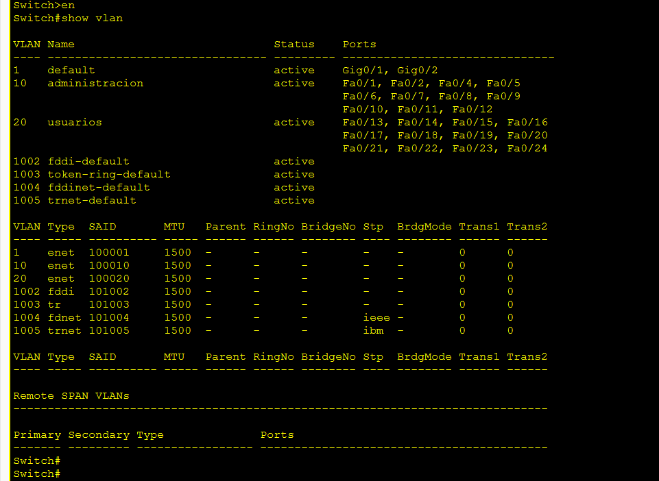
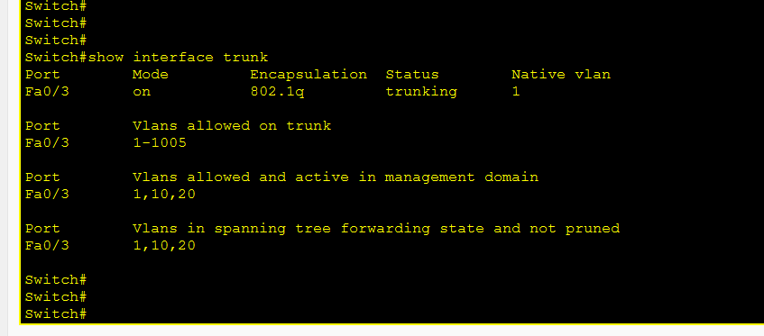
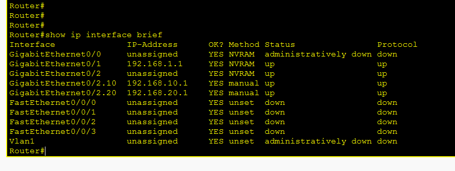
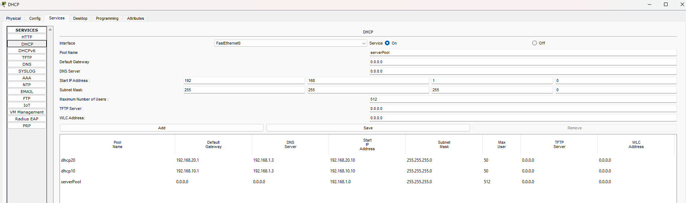
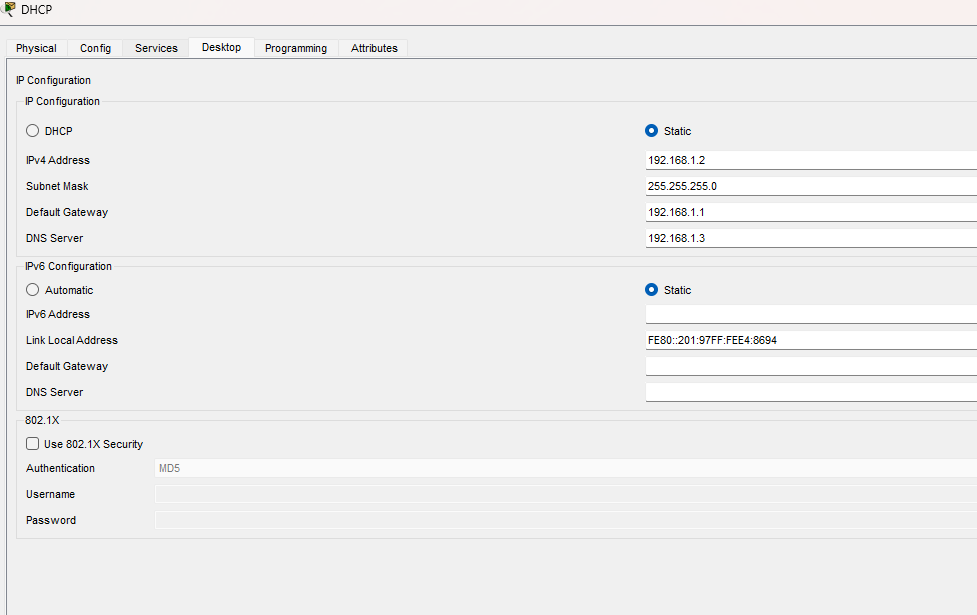
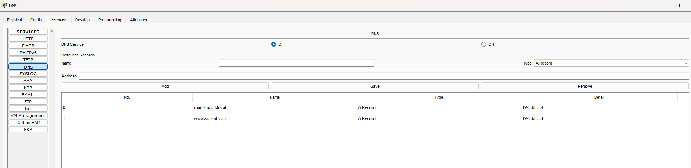
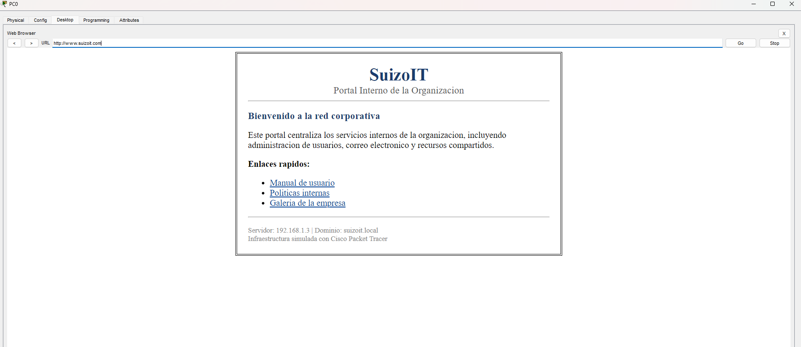
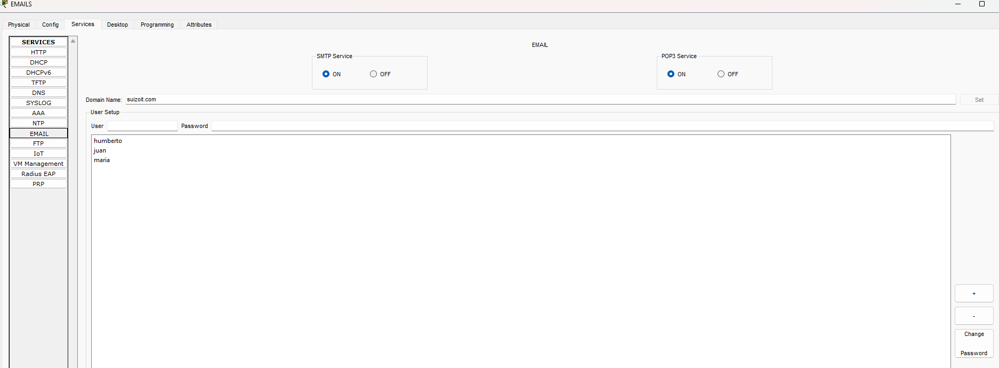
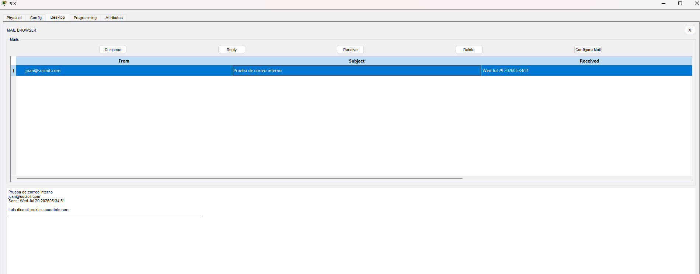
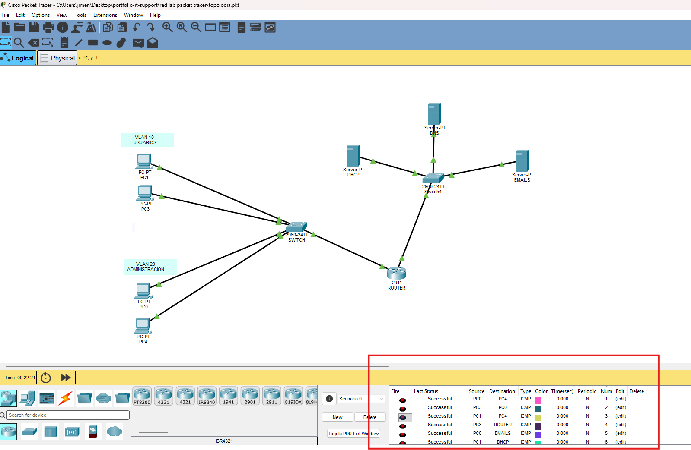

# Proyecto 03: Laboratorio de Red — VLANs, DHCP, DNS, HTTP y Email

Simulación de una infraestructura de red pequeña en Cisco Packet Tracer, con segmentación por VLANs, enrutamiento inter-VLAN, y servicios de red centralizados (DHCP, DNS, HTTP y Email).

## 🎯 Objetivo

Diseñar y configurar una red funcional que demuestre:
- Segmentación de red mediante VLANs
- Enrutamiento inter-VLAN (Router-on-a-Stick)
- Asignación dinámica de IP por VLAN mediante un servidor DHCP centralizado
- Resolución de nombres de dominio mediante DNS
- Publicación de un portal web interno
- Servicio de correo electrónico interno con envío y recepción entre usuarios

## 🗺️ Topología

```
Servidor (DHCP/DNS/HTTP/Email)
        │
   GigabitEthernet0/1 (Router)
        │
      Router (2911)
        │
   GigabitEthernet0/2 (trunk)
        │
   FastEthernet0/3 (Switch, modo trunk)
        │
     Switch (2960)
    ┌───┴───┐
Fa0/1-12   Fa0/13-24
(VLAN 10)  (VLAN 20)
   │           │
  PCs         PCs
Administracion Usuarios
```

## 📋 Direccionamiento IP

| Elemento | Red / IP |
|---|---|
| VLAN 10 (Administración) | 192.168.10.0/24 — Gateway: 192.168.10.1 |
| VLAN 20 (Usuarios) | 192.168.20.0/24 — Gateway: 192.168.20.1 |
| Red de Servidores | 192.168.1.0/24 |
| Router → Servidores (Gi0/1) | 192.168.1.1 |
| Servidor DHCP/DNS/HTTP | 192.168.1.3 |
| Servidor Email | 192.168.1.4 |
| Rango DHCP VLAN 10 | 192.168.10.10 en adelante |
| Rango DHCP VLAN 20 | 192.168.20.10 en adelante |

## ⚙️ Configuración del Switch

Creación de VLANs y asignación de puertos (12 puertos por VLAN), con un puerto dedicado en modo trunk hacia el router.



```
vlan 10
 name administracion
vlan 20
 name usuarios

interface range fastEthernet0/1-12
 switchport mode access
 switchport access vlan 10

interface range fastEthernet0/13-24
 switchport mode access
 switchport access vlan 20

interface fastEthernet0/3
 switchport mode trunk
```



## ⚙️ Configuración del Router (Router-on-a-Stick)

Subinterfaces con encapsulación 802.1Q, una por cada VLAN, permitiendo el enrutamiento entre ellas.



```
interface gigabitEthernet0/1
 ip address 192.168.1.1 255.255.255.0
 no shutdown

interface gigabitEthernet0/2
 no shutdown

interface gigabitEthernet0/2.10
 encapsulation dot1Q 10
 ip address 192.168.10.1 255.255.255.0

interface gigabitEthernet0/2.20
 encapsulation dot1Q 20
 ip address 192.168.20.1 255.255.255.0
```

## ⚙️ Configuración del Servidor DHCP

Dos pools, uno por VLAN, repartiendo IPs desde el servidor centralizado (no desde el router).



| Pool | Gateway | DNS Server | Rango inicial |
|---|---|---|---|
| dhcp10 | 192.168.10.1 | 192.168.1.3 | 192.168.10.10 |
| dhcp20 | 192.168.20.1 | 192.168.1.3 | 192.168.20.10 |



## ⚙️ Configuración del Servidor DNS

Registro tipo A resolviendo el nombre del portal interno hacia la IP del servidor web.



| Nombre | Tipo | Dirección |
|---|---|---|
| www.suizoit.local | A Record | 192.168.1.3 |

## ⚙️ Configuración del Servidor HTTP

Página web personalizada como portal interno, accesible por nombre de dominio.



## ⚙️ Configuración del Servidor de Email

Dominio interno configurado con SMTP y POP3 activos, y usuarios creados para pruebas de envío/recepción.



| Usuario | Dominio |
|---|---|
| juan@suizoit.com | suizoit.com |
| maria@suizoit.com | suizoit.com |



## ✅ Prueba de conectividad final

Ping exitoso entre VLANs, confirmando el enrutamiento inter-VLAN correcto a través del router.



## 📌 Conclusiones

Este laboratorio permitió practicar de forma integral conceptos fundamentales de redes: segmentación mediante VLANs, enrutamiento inter-VLAN, DHCP centralizado, resolución de nombres, publicación de servicios web, y mensajería interna — replicando a pequeña escala la arquitectura de red de una organización real.